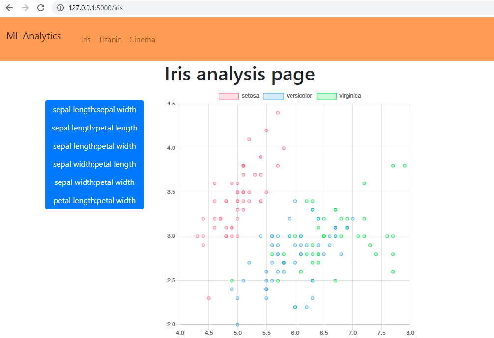

# ml_analytics
Портал с аналитикой данных по машинному обучению

## Структура проекта
Бэкенд написан на flask. Фронтенд - HTML, CSS, JS. Для отрисовки графиков используется Chart.js

При запуске проекта переходите в браузере по ссылке http://127.0.0.1:5000, далее в вкладках доступны данные по разным датасетам для машинного обучения.

Например, во вкладке Iris есть графики, показывающие в разных координатах четырехмерные данные по цветам ириса.

## Запуск проекта
Скачайте проект и в корневой директории выполните команду:

    python3 app.py

Далее, переходите по ссылке в браузере: http://127.0.0.1:5000

